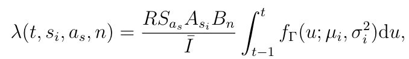

OpenABM-Covid19: Agent-based model for modelling the Covid-19 and Contact-Tracing
========================================================================

Overview
-----------

Our agent-based model (ABM) was developed to simulate the spread of COVID-19 in a city, and to analyse the effect of both passive and active intervention strategies.
Its primary purpose at this stage is to assist the design and evaluation of approaches to instantaneous contact tracing using a mobile phone app that measures proximity events between phones with the app.
The ABM explores the effectiveness of such a contact-tracing app intervention by modelling five alternative scenarios which differ in how far the contact tracing extends through the contact network, and the conditions on which individuals are released from app-instructed quarantine.

In the absence of therapeutical interventions, a key intervention for preventing infectious disease spread is detecting cases and tracing their contacts, so that those at risk of infecting others can be isolated.
An ABM is well-suited to quantifying the effects of combinations of non-pharmaceutical interventions in an epidemic because, unlike a simple epidemiological model, it records a history of previous events.
The ABM was developed using the most relevant representation of the human contact network for a directly transmitted short-generation-time pathogen.
It includes the three major domains of interaction: the home, the workplace (or school for children, or a regular social environment for older individuals), and the random interactions of daily life and travel.
The ABM is age-stratified.
It is not spatially stratified at this stage.
The contact processes are currently parameterised based previous work interviewing participants; they will be updated based on contact data collected by phone.  
The model of infection spread via interactions between individuals is parameterised based on the current  literature of COVID-19 epidemiology and can be updated as more data emerges.
The disease process is currently modelled to ensure that the time-scales of disease progression are correct. 
Since the impact of COVID-19 on hospitals is large, and the clinical outcome of infection depends on access to good hospital care, a more detailed model of patient flows and transmission within hospitals is planned. 

Demographics
-----------

The demographics of the ABM are based upon UK national data for 2018 from the Office of National Statistics (ONS). 
Individuals are categorised into nine age groups by decade, from age group (0-9 years) to (80+ years). 
The simulation is run on a static population and the proportion of individuals in each age group is the same as that specified by the population level statistics in Table [Demographic parameters](./parameters/demographic_parameters.md).
Every individual is part of a household, which forms an important part of their daily interactions.
Household size data is shown in Table [Demographic parameters](./parameters/demographic_parameters.md).
Since the duration of the simulated epidemic is less than a year, we do not consider changes in the population due to births, deaths due to other causes, and migration.

Interaction Network
-----------

Every individual in the population is represented by a node in the simulation. 
Interactions between individuals are modelled via connections between nodes.
The connections form networks, which are generated to represent different types of daily interactions.
In this work we consider three types of networks that represent household, workplace, and miscellaneous interactions for the studied population.
Some of these networks are static and recur daily (e.g. household), whilst others are transient and are regenerated daily (e.g.  miscellaneous).
The interaction networks have two roles in the ABM.
First, they model the transmission of infection between individuals on each day that a connection is made.
Second, when we model contact tracing via the phone app, the phone sees a subset of the network which is then used for contact tracing.

The membership of different networks leads to age-group assortativity in the interactions.
A previous study of social contacts for infectious disease modelling has estimated the mean number of interactions that individuals have by age group [[1]](#1).
This study is based on participants being asked to recall their interactions over the past day. 
We estimate mean interactions by age group by aggregating data (see Table **Mean Daily Interactions**).
It is possible for an individual not to be connected to anybody (e.g. a person living alone in a household).

### Household Network

Each individual is assigned to live in a single household.
Each day every person has an interaction with everybody within their household.
The proportion of people living in households of different sizes is taken from ONS data.
There are two important population-level aggregate statistics that we match: the household-size structure and the population age-structure. When individuals are assigned to households, we need to match these aggregate statistics and also require that our households reflect typical age mixes.
To achieve this we use a reference panel of 10,000 households containing the household composition by age, produced by down-sampling UK-wide household composition data from the 2011 Census produced by the ONS <a id="11">[11]</a>.
The household structure was then generated by sampling from the reference household panel with replacement.
To match the aggregate statistics for the population, we used a rejection-sampling method.
Households were sampled sequentially from the reference panel and accepted if, when combined with the existing samples, the discrepancy with the target aggregate statistics was reduced.
If the discrepancy with the target aggregate statistics increased by less than a threshold, the new sample was retained, otherwise it was rejected.
The threshold changes dynamically with each sample depending on whether it was accepted or rejected to keep a constant rejection rate throughout the sampling.
The discrepancy between the sample aggregate statistics and the target aggregate statistics was calculated by taking the sum of the square of the differences. 
Finally, we checked the discrepancy of the total sampled set of households against the aggregate statistics and rejected the whole sample if it was above a threshold.

### Workplace Networks
Each individual is a member of one workplace network (including e.g. schools for children and social activities for older adults). 
The workplace networks are modelled as Watts-Strogatz small-world networks [[2]](#2).
When constructing the workplace networks, we ensure the absence of overlaps between the household interactions and the local interactions on the small-world network.
Every day each person interacts with a random subset (50%) of their connections on their workplace network.
For children, there are separate workplace networks for the both the 0y-9y age group (i.e. primary schools) and 10y-19y age groups (i.e secondary schools). 
On each of these networks we introduce a small number of adults (1 adult per 5 children) to represent teaching and other school staff.
Similarly for the 70y-79y age group and the 80y+ age group we have separate networks representing day-time social activities among elderly people (again with 1 adult per 5 elderly people).
All remaining adults (the vast majority) are part of the 20y-69y network.
Due to the difference in total number of daily interactions, each age group has a different number of interactions in their workplace network.
Parameters and values corresponding to the workplace network are shown in Table [Workplace network parameters](./parameters/work-place_network_parameters.md).
Note the parameters are for the mean daily connections, so the number of interactions on the network are higher due to the daily sampling of connections.

### Random Network
In addition to the recurring structured networks of households and workplaces, we include a number of random interactions as well.
These interactions occur once and are independent of the previous day's connections.
The number of random connections an individual makes is the same each day (without interventions) and is drawn at the start of the simulation from a negative-binomial distribution, an over-dispersed skew distribution.
This variation in the number of interactions introduces 'super-spreaders' into the network who have many more interactions than average.

The mean numbers of connections were chosen so that the total number of daily interactions matched that from a previous study of social interaction [[1]](#1). 
The number of random interactions was chosen to be lower in children in comparison to other age groups. 
In the simulation, each day a list is created containing all individuals who make random interactions and each person is repeated by the number of interactions they make.
This list is shuffled and interactions are made between adjacent pairs on the shuffled list.  Parameters associated with random networks are listed in Table [Random network parameters](./parameters/random_network_parameters.md).  

## Infection Dynamics
The infection is spread by interactions between infected and susceptible individuals. 
The rate of transmission is determined by three factors: the status of the infector; the susceptibility of the infectee to infection, according to age; and the type of interaction (i.e. on which network it occurred).
We present the details of each of these rates below.
We currently do not have data on the distribution of the duration of interactions, so the effect of this on transmission is not modelled.

To model **the status of the infector** we note that infectiousness varies over the natural course of an infection, i.e. as a function of the amount of time a person has been infected, &#964;.
Infectiousness starts at zero at the precise moment someone is infected (&#964;=0), reaches a peak at some intermediate time, and tends to zero a long time after infection (large &#964;).

Following [[3]](#3), we take the functional form of infectiousness to be a (scaled) gamma distribution. 
We chose the mean and standard deviation as intermediate values between different reports [[3]](#3)[[4]](#4)[[5]](#5).  

We define *asymptomatic* individuals as those who never develop symptoms during their infection, and *pre-symptomatic}* individuals as those who do not currently have symptoms but will do so later.
Both types of individuals may infect others.
The overall infectiousness of asymptomatic individuals has been estimated to be lower [[6]](#6), reflected in our parameter `asymptomatic_infectious_factor`.
Individuals who show symptoms but only mildly have also been estimated as less infectious than those with more severe symptoms [[6]](#6), reflected in our parameter `mild_infectious_factor`.
For each adult age category, we took the fraction of symptomatic infections that are mild as the fraction of confirmed cases with either no pneumonia (which was rare -- always less than 6.5%) or mild pneumonia, i.e. the fraction without severe pneumonia, reported in [[7]](#7).
For the age categories 0-9 and 10-19, we took the fraction of infections that are mild as the fraction clinically defined as 'mild' in the paediatric meta-analysis [[8]](#8), excluding asymptomatic infections from the denominator.
These fractions of symptomatic infections that are mild by age are listed in Table [Disease dynamics parameters](./parameters/disease_dynamics_parameters.md).

To model the **susceptibility to infection of a contact according to their age** we referred to the literature [[6]](#6)[[9]](#9)[[10]](#10) where close contacts of confirmed cases were monitored and tested.
The number tested and the number of positive results was reported within each age group, with the ratio of the latter to the former defining the per-age attack rate.
We assumed the proportion testing positive was constant within each age bin in each study, and merged the counts into a single set of bins 0-9, 10-19, ... 80+, with contributions from all three studies.
The largest age bin in each study (which differed in its lower bound, with no upper bound) was assumed to be ten years wide in order to define the merging; the counts in the resulting 80+ category were excluded for the following fitting step as they were sensitive to the assumed upper bound in each study.
We fit the polynomial form *A* + *B* x agek* to the proportions in each age category, using the bin's midpoint, minimising the sum of squared differences from the observed values.
The best fitting values of *A*, *B* and *k* were 0.0300, 5.53x10-6,, and 2.00 respectively.
We took the values predicted by this fit at each age bin's mid-point to define the relative susceptibility of each age group.
A final normalisation factor was defined so that the average susceptibility for an individual in a population with the age distribution considered here was 1, defining our parameters `relative_susceptibility_0_9` etc.
The merged data and fit are shown in Table **Susceptibility** and are shown in the figure below.

Finally, we model the **type of interaction**, i.e. on which network it took place.
Whilst we do not have data on the length of interactions, interactions which take place within a person's home are likely to be closer than other types of interactions leading to higher rates of transmission.
This is modelled using a multiplicative factor.
Combining all effects, we model the rate at which the virus is transmitted in a single interaction by

where *t* is the time since infection; *si* indicates the infector's symptom status (asymtomatic, mild, moderate/severe); *as* is the age of the susceptible; *n* is the type of network where the interaction occurred; *I* is the mean number of daily interactions; *f&#915;(u; &#956;,&#963;2)* is the probability density function of a gamma distribution; *&#956;i* and *&#963;i* are the mean and width of the infectiousness curve; *R* scales the overall infection rate (under some simplifying assumptions it is mean number of people infected by each moderately/severely symptomatic individual); *Sas* is the scale-factor for the age of the susceptible; *Asi* is the scale-factor for the infector being asymptomatic; *Bn* is the scale-factor for the network on which the interaction occurred.
Table [Infection parameters](./parameters/infection_parameters.md) contains the values of the parameters used in simulations.
The rate of virus transmission is converted to a probability of transmission

The epidemic is seeded by infecting a number of individuals at the start of the infection.
The infection was assumed to take place immediately before the simulation starts.

## Natural history of infection

Upon infection, an individual enters a disease progression cascade where the outcome and rates of progression depend on the age of the infected person.
The disease state transitions are shown in the Figure below and the model parameters are in Table [Disease dynamics parameters](./parameters/disease_dynamics_parameters.md).

A fraction  &#966;asym(age) of individuals are asymptomatic and do not develop symptoms, a fraction  &#966;mild(age) will eventually develop mild symptoms, and the remainder develop moderate/severe symptoms.
Each of these proportions depend on the age of the infected individual.
Those who are asymptomatic are infectious (at a lower level) and will move to a recovered state after a time &#964;a,rec drawn from a gamma distribution.
Once an individual is recovered we assume that they have immunity and cannot be reinfected.

Individuals who will develop symptoms start by being in a pre-symptomatic state, in which they are infectious but have no symptoms.
The pre-symptomatic state is important for modelling interventions because individuals in this state do not realise they are infectious, therefore they cannot self-isolate to prevent infecting others.
Individuals who develop mild symptoms do so after time &#964;sym and then recover after time &#964;rec (both drawn from gamma distributions).
The rest of the individuals develop moderate/severe symptoms after a time &#964;sym drawn from the gamma distributed.

Whilst most individuals recover without requiring hospitalisation, a fraction  &#966;hosp(age) of those with moderate/severe symptoms will require hospitalisation.
This fraction is age-dependent.
Those who do not require hospitalisation recover after a time &#964;rec drawn from a gamma distribution, whilst those who require hospitalisation are admitted to hospital after a time &#964;hosp, which is drawn from a shifted Bernoulli distribution (either 5 or 6 days).

Among all hospitalised individuals, a fraction  &#966;crit(age) develop critical symptoms and require intensive care treatment, with the remainder recovering after a time &#964;hosp,rec drawn from a gamma distribution.
The time from hospitalisation to developing critical symptoms, &#964;crit, is drawn from a shifted Bernoulli distribution (either 2 or 3 days).
Of those who develop critical symptoms, a fraction  &#966;ICU(age) will receive intensive care treatment (note for most age groups this will be everybody, however, for the most elderly age groups it may be deemed inappropriate). 
For patients receiving intensive care treatment, a fraction  &#966;death(age) die after a time &#964;death drawn from a gamma distribution, with the remainder leaving intensive care after a time &#964; crit,surv.
Patients who require critical care and do not receive intensive care treatment are assumed to die upon developing critical symptoms.
Patients who survive critical symptoms remain in hospital for &#964;hosp,rec before recovering.

## Immunity Model

The ABM supports 3 types of immunity from SARS-CoV-2:

1. *Full* - someone with full immunity cannot contract the virus so cannot transmit it.
2. *From Symptoms* - someone with immunity from symptoms can contract the virus but does not develop symptoms, however, can transmit the virus to others. In the ABM this is modelled by forcing the individual down the asymptomatic disease pathway. Note that people who are asymptomatic are assumed to have a lower rate of infectiousness compared to those with symptomatic disease.
3. *From Severe Symptoms* - someone with immunity from severe symptoms can contract the virus, they can develop symptoms and they can transmit the virus to others. However, they cannot develop severe symptoms so will not be hopsitalised or die from the disease. In the ABM this is modelled by preventing the person going down the hopsitalised path in the disease model (i.e. set (&#966;hosp(age) =0)). Note that split between asymptomatic/mild-symptoms/symptoms is the same as someone with no immunity, so the mean transmission rate is the same as someone without immunity.

On recovering from an infection, everybody gains immunity for a period of time, which is assumed to be *full* immunity. 
Immunity wanes over time according to the shifted exponential distribution (default parameters in the model assume no waning). 
Immunity is assumed to be polarised, in that if the individual gains a certain type of immunity they will have that level of immunity each time they are challenged by the virus, until they gain additional immunity or it wanes.

## Multiple Strains

The ABM also supports the option to model multiple variants of the virus. 
Each strain of the virus can have different levels of transmissibility, modelled as a multiplier which is applied to the overall infectious rate.
Additionally, the strains can have different virulence, which is modelled by modifying the fraction of people with moderate symptoms who are hospitalised (&#966;hosp(age) ).
Multiple simultaneous infections are not allowed *i.e.* once somebody has been infected by a virus and enters the disease cascade, they are not able to contract another variant until they recover.
Upon recovering from the an infection, cross-immunity to other strains can be conferred upon the individual according to a cross-immunity matrix. 
If cross-immunity is conferred to a strain, it is polarising (i.e. the same for multiple challenges) and wanes at the same time that the immunity wanes to the strain that the person was infected.
With more than three strains, cross-immunity between strains is assumed to be fully correlated *i.e.* if somebody gains immunity to a strain where the cross-immunity is 60%, then they will also have immunity to all strains where the cross-immunity is greater than 60%.
Immunity gained via infection from another strain of the virus is assumed to be full immunity.
If immunity to a particular strain is conferred multiple times due to cross-infections, then the time at which the immunity wanes is assumed to be the maximum across all infections.

## Vaccination

The ABM supports the option vaccinate individuals in the population.
Each type of vaccine has the ability to confer each type of immunity (full, from symptoms or from severe symptoms) to each strain at different levels of efficacy.
It is assumed that the immune response is fully correlated, such that if one type of immunity (e.g. full immunity to alpha strain) is conferred where the vaccine has a 60% efficacy, then all other types of immunity with efficacy greater than 60% will also be conferred (e.g. immunity from severe symptoms to the delta strain).
Immediately after a vaccine is given, there is period of time before immunity is conferred, and then immunity will wane after a set time.
Vaccines can only ever increase immunity, therefore if immunity has be conferred due to an earlier infection, then vaccination can only ever increase the level/type of immunity and for longer.

## Passive Interventions

The ABM has the ability to model both passive and active non-pharmaceutical interventions.  Interventions are designed to reduce the rate of transmission but have the potential to quarantine significant numbers of people.  We define passive interventions to be those which do not involve testing or contact tracing. Here we provide details on each of the passive interventions and their impact on the contact network.  Table [Passive intervention parameters](./parameters/passive_intervention_parameters.md) summarises the parameters in the model associated with passive interventions.  

### Hospitalisation 
Upon hospitalisation, a patient immediately stops interacting with both their household and workplace networks. The number of random interactions that they have is reduced.  More detailed modelling of hospitals is contained in the hospital module of OpenABM-Covid19, see [the documentation on the hospital module](hospital_model.pdf) for further details.  

### Self-quarantine upon symptoms
Upon experiencing symptoms, a proportion of individuals self-quarantine immediately as per government advice.  There is a daily dropout rate for the duration of the quarantine to model individuals failing to comply.
We also allow for the development of symptoms which cause an individual to self-quarantine when in fact they do not have COVID-19, for example they may have seasonal flu which has similar symptoms.
Quarantine is modelled by stopping interactions on the individual's workplace network and greatly reducing their number of interactions on the random network.  The ABM also contains the option that everybody in the household of a person with symptoms will be asked to self-quarantine.

### Lock-down
The ABM can simulate the effect of a country-wide lock-down by reducing the number of contact that people have. 
In a lock-down, the number of interactions that people have is reduced by 80% on both their work-place and random networks.  Additionally, given that during a lock-down people stay at home more, we increase transmission rate for interactions on the household network by a factor. 

### Shield Group
Given that fatality rate is highly skewed towards the over 70s, we have the option of applying a lock-down just to this demographic group. 
The effect of the lock-down is the same as that described in the previous section, with the exception that interactions on the household network are not increased.

## Active Interventions

Active interventions are defined to be those which involve contact tracing or testing.  There are three events in the ABM which can be the initial trigger for an active intervention:
1. developing symptoms (true covid-19 or not) in the community 
2. testing positive for covid-19
3. hospitalisation (clinical diagnosis alone, or combined with a positive test result) 

The individual who provides this initial trigger is the index-case.
There are three types of active intervention which can be triggered:

1. testing for covid-19 infection
2. self-quarantining
3. digital contact tracing

Table [Active intervention parameters](./parameters/active_intervention_parameters.md) summarises the parameters in the model associated with active interventions.  

### Testing for infection
Currently the test for SARS-COV-2 is not sensitive immediately upon infection, which we model by only returning a positive test if the patient has been infected for three days when the test takes place. 
There are also delays in the testing procedure between ordering and taking a test, and then getting results.
These test delays are modelled in the ABM, adding further delays to interventions and so reducing their efficacy.
When an individual has received a positive test they should already be self-quarantining, but we continue to include a dropout rate for poor adherence.
A positive test can also trigger digital contact tracing, if this was not triggered already when an individual reported symptoms.

### Self-quarantining
Individuals are asked to self-quarantine upon developing symptoms, receiving a positive test and / or being contact-traced. 
Again, we use a daily random dropout rate for individuals leaving quarantine early, and quarantine is modelled by stopping interactions on the individual's workplace network and greatly reducing their number of interactions on the random network.

### Digital contact tracing
We model app-based contact tracing which can initiate the quarantining of infected individuals prior to them showing symptoms or testing positive. 
For infections with high levels of pre-symptomatic transmission, contact tracing is vital to control epidemics. 
In the model, contact tracing can only originate from somebody with the app and can only trace others who also have the app. 
App uptake is age-dependent in our model based on smartphone ownership data.
Digital proximity sensing is likely to miss some interactions between individuals even if both individuals have the app, so when contact tracing we randomly drop a number of interactions. 
To contact trace we go through all the interactions the individual has had for the past seven days where both parties have the app and the interaction has not been missed.
The ABM allows us to explore various policy options such as requesting traced individuals to self-quarantine, requesting tests for traced individuals, and requesting that their household self-quarantine too.
The ABM also contains the option for recursive tracing of contacts of contacts.

### Quarantine Release
In additional to completing the specified quarantine time or dropping-out, there are two other mechanisms for ending quarantine.
The first is if the index-case tests negative for covid-19, at which point a message is sent to all contacts who were originally traced telling them they can stop quarantining. 
Note, if an individual has been traced by multiple index-cases, they only get the release message once all index-cases have tested negative.
The second mechanism for the early termination of quarantining uses the tracing network to determine whether it is likely the (self-reported) index-case did not have covid-19.
After `quarantine_smart_release_day`
days of an index-case reporting symptoms, we check to see if any of the traced individuals have developed symptoms.
If none have developed symptoms, we send a release message to all those traced that they can stop quarantining (with the same caveat for those traced by multiple index-cases). 

## Implementation Details
This is a high-level description of how the ABM is implemented.
It is coded in C, using an object-orientated pattern.
All required memory is pre-allocated at the start of the simulation for efficiency.

### Events
We use an event-based system to drive disease progression in individuals and interventions, where at each decision point we calculate when the next event will occur and add it to an event list for that day.
For each type of event there is an `eventlist` structure which contains an array of linked lists for each day of the simulation.
We use doubly linked lists to allow for efficient deletion as well as insertion of events.
Event lists also keep track of the current and total number of events by type (defined as all entries today and in the past). 

### Individuals
Each person in the population is represented by an `individual` structure and the population is static.
The `individual` structure contains the following information:
1. Demographic - age, house number, network membership
2. Interaction diary - list of all interactions over a period of days (note this is not only the ones tracked by the app)
3. Disease - current status (i.e. symptomatic, severity) and pointers to both current and future disease events
4. Quarantine - is the person currently quarantined, and pointers to that event and the release event

### Network Construction
Each interaction network has an associated `network` structure which contains an array of edges.
Network structures can be static (i.e. household), static but down-sampled (i.e. workplace) or dynamically generated at each time step (i.e. random).
Network generation is modular and any network can be added to the ABM as long as it can be represented by an array of edges.
Once all the networks have been defined, we add each edge to the individual's interaction diary (which are single-linked lists as deletion is not required).

### Transmission
The next step is to transmit the pathogen across today's interaction network, which is done as a push from all infected people (by disease status).
For every infection status we pre-calculate the transmission rate for someone who has been infected for that length of time.
At each time-step we go through all the interactions the infected person had for that day and calculate whether transmission has occurred.
Instead of randomly drawing whether transmission has occurred for each interaction, we allocate each individual a quantity of *hazard* (from an exponential distribution) at the start of the simulation.
Each interaction with an infected person reduces the persons *hazard* and when a person's *hazard* drops below 0 they become infected. 
This is mathematically equivalent to randomly drawing individual interactions, which can be seen by calculating the probability of  being infected by the *N*th interaction  *P*(infected *N*th), after exposure to interactions with hazard-rates &#955;1,..,&#955;N 

where *T* is distributed exponentially with mean 1. 
The fact that different age groups have different susceptibilities (*Sas*) is then modelled by allocating different amounts of initial *hazard* to each group.
This improves computational efficiency so it is not necessary to draw a random variable for each potential transmission event.

### Digital Tracing and Release
When an individual self-reports symptoms or tests positive, they become an index case and are assigned an index token (which form a linked list). 
Digital tracing is performed by looping through all contacts in the interaction diary and if the app recorded the interaction (i.e. both individuals have the app and the interactions was not randomly missed), a quarantine message is sent along with the index token.
Individuals store every index token they have been traced by for 14 days.
Upon a negative test of the index case (or other release mechanism), a message is sent to every phone with that index token to remove it.
Upon removal of all index tokens, an individual is automatically released from quarantine.

### Performance 
The ABM for 100k individuals takes approximately 100ms per day to run and requires 250Mb of memory on a 2015 MacBook Pro. 
Both speed and memory are linear in population size (tested from 100k to 1m). 
96% of the CPU usage is spent on rebuilding the daily interaction networks and updating the individual's interaction diaries.
About 60% of the memory usage is spent on storing the interaction diaries (for 5 days), another 20% is spent on storing the semi-static networks with the remaining 20% spent on storing individuals and their states in event lists.

## References
<a id="1">[1]</a> 
Joel Mossong, Niel Hens, Mark Jit, Philippe Beutels, Kari Auranen, Rafael Mikolajczyk, Marco Massari, Stefania Salmaso, Gianpaolo Scalia Tomba, Jacco Wallinga, et al. Social contacts and mixing patterns relevant to the spread of infectious diseases. PLoSmedicine, 5(3), 2008

<a id="2">[2]</a> 
Duncan J Watts and Steven H Strogatz. Collective dynamics of ‘small-world’ networks. Nature, 393(6684):440, 1998.

<a id="3">[3]</a> 
Luca Ferretti, Chris Wymant, Michelle Kendall, Lele Zhao, Anel Nurtay, Lucie Abeler-Dorner, Michael Parker, David Bonsall, and Christophe Fraser. Quantifying SARS-CoV-2 transmission suggests epidemic control  with  digital  contact tracing. Science, 2020.

<a id="4">[4]</a> 
Tapiwa Ganyani, Cecile Kremer, Dongxuan Chen, Andrea Torneri, Christel Faes, JaccoWallinga, and Niel Hens. Estimating the generation interval for COVID-19 based on symptom onset data.medRxiv, 2020.

<a id="5">[5]</a> 
Shujuan Ma, Jiayue Zhang, Minyan Zeng, Qingping Yun, Wei Guo, Yixiang Zheng, ShiZhao,  Maggie  H  Wang,  and  Zuyao  Yang.   Epidemiological  parameters  of  coronavirus disease 2019: a pooled analysis of publicly reported individual data of 1155 cases from seven countries. medRxiv, 2020.

<a id="6">[6]</a> 
Lei Luo, Dan Liu, Xin-long Liao, Xian-bo Wu, Qin-long Jing, Jia-zhen Zheng, Fang-huaLiu, Shi-gui Yang, Bi Bi, Zhi-hao Li, Jian-ping Liu, Wei-qi Song, Wei Zhu,  Zheng-heWang, Xi-ru Zhang, Pei-liang Chen, Hua-min Liu, Xin Cheng, Miao-chun Cai, Qing-meiHuang, Pei Yang, Xin-fen Yang, Zhi-gang Huang, Jin-ling Tang, Yu Ma, and Chen Mao.Modes of contact and risk of transmission in covid-19 among close contacts. medRxiv, 2020.

<a id="7">[7]</a> 
Yang Yang, Qingbin Lu, Mingjin Liu, Yixing Wang, Anran Zhang, Neda Jalali, NatalieDean, Ira Longini, M. Elizabeth Halloran, Bo Xu, Xiaoai Zhang, Liping Wang, Wei Liu,and Liqun Fang. Epidemiological and clinical features of the 2019 novel coronavirus outbreak in China. medRxiv, 2020.

<a id="8">[8]</a> 
Tiago Henrique de Souza, Jose Antonio Nadal, Roberto Jose Negrao Nogueira, Ricardo Mendes Pereira, and Marcelo Barciela Brandao. Clinical manifestations of children with COVID-19: a systematic review. medRxiv, 2020.

<a id="9">[9]</a> 
Juanjuan Zhang, Maria Litvinova, Yuxia Liang, Yan Wang, Wei Wang, Shanlu Zhao,Qianhui Wu, Stefano Merler, Cecile Viboud, Alessandro Vespignani, Marco Ajelli, and Hongjie Yu. Age profile of susceptibility, mixing, and social distancing shape the dynamics of the novel coronavirus disease 2019 outbreak in china. medRxiv, 2020.

<a id="10">[10]</a> 
Qifang Bi, Yongsheng Wu, Shujiang Mei, Chenfei Ye, Xuan Zou, Zhen Zhang, Xiaojian Liu, Lan Wei, Shaun A Truelove, Tong Zhang, Wei Gao, Cong Cheng, Xiujuan Tang,Xiaoliang Wu, Yu Wu, Binbin Sun, Suli Huang, Yu Sun, Juncen Zhang, Ting Ma, JustinLessler,  and Teijian Feng.  Epidemiology and transmission of COVID-19 in ShenzhenChina:  Analysis of 391 cases and 1,286 of their close contacts. medRxiv, 2020.

<a id="11">[11]</a> 
UK Office of National Statistics household composition data aggregated from 2011 UK Census. https://www.ons.gov.uk/peoplepopulationandcommunity/housing/adhocs/11569ct10892011census

